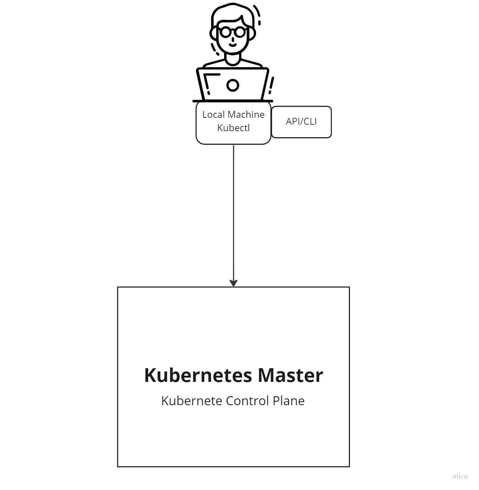

# Kubernete Quick Start

The tool we are going to use to create the clusters is kind.

kind is a tool for running local Kubernetes clusters using Docker container “nodes”.
[documentation](https://kind.sigs.k8s.io/)

## Creating a Cluster

Creating a Kubernetes cluster is as simple as `kind create cluster`

⠊⠁ Ensuring node image (kindest/node:{version_kind}) 🖼

✓ Preparing nodes 📦

✓ Writing configuration 📜

> wait until finished configuring the cluster

More usage can be discovered with kind `create cluster --help`

We've just created our first cluster, you'll probably see this at the end. 👏

```shell
Set kubectl context to "kind-kind"
You can now use your cluster with:

kubectl cluster-info --context kind-kind
```

After creating a cluster, you can use kubectl to interact with it by using the configuration file generated by kind.

## **What is Kubectl? 🤔**

Command line tool for communicating with a Kubernetes cluster's control plane, using the Kubernetes API.
[reference/glossary](https://kubernetes.io/docs/reference/glossary/?all=true#term-kubelet)



### **Control Plane** 🤓

The container orchestration layer that exposes the API and interfaces to define, deploy, and manage the lifecycle of containers.
This layer is composed by many different components, such as: 
- etcd
- API Server
- Scheduler
- Controller Manager
- Cloud Controller Manager
- ReplicaSet
- Replication Controller

[reference/glossary](https://kubernetes.io/docs/reference/glossary/?all=true#term-control-plane)


## **Resume**😌

kubectl is a command-line tool for communicating with a control plane Kubernetes cluster.
Control Plane exposes an API from which it is possible to interact with the cluster.👌

By default, the cluster access configuration is stored in ${HOME}/.kube/config

**What's inside config? 🧐**

Has all the credentials to access a cluster.

Now let's communicate with cluster


`kubectl cluster-info --context kind-kind`


Now kubectl already communicates with the "kind-kind" cluster created by kind.

digite `docker ps` to list container and you will see that you have a container running "kind-control-plane"

That means it's working 🤗